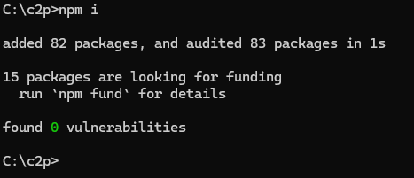
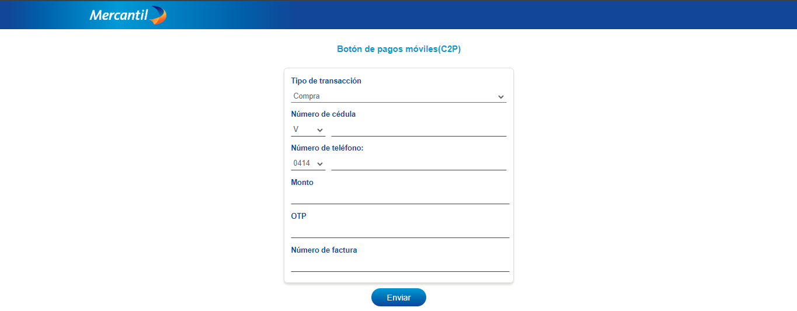
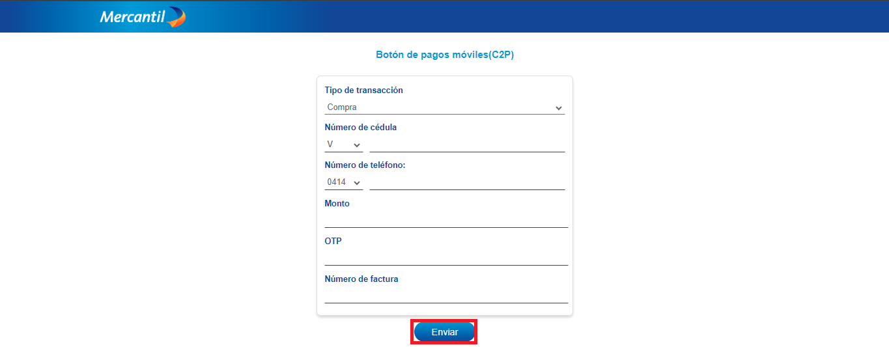
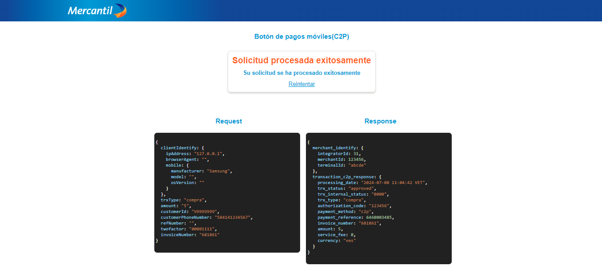

# Botón de pagos móviles(C2P, vuelto y anulación).

[Más informacion sobre el API.](https://apiportal.mercantilbanco.com/mercantil-banco/produccion/product/21034)

### Índice
    
1. [Ejemplo de encriptación](./modules/crypto.js)
2. [Ejemplo de petición fetch](./modules/c2p.js)
3. [API Playground](#playground)<br>
3.1 [Configuración y uso del API playground](#playground-config)<br>
3.2 [Ejemplos de uso del API playground](#playground-examples)
4. [Request y Response](#rq)
5. [Códigos de error](#error-codes)


<a id="playground" ></a>
## API Playground

<a id="playground-config"> </a>
### Configuración y uso del API Playground

**Debes tener instalado [NodeJS(^20.12.2)](https://nodejs.org/) para la correcta configuración y ejecución de este ejemplo.**

1. Descargar el código de ejemplo ubicado en este repositorio haciendo click [aquí](https://github.com/apimercantil/api-playground/releases/download/V1/c2p.zip).<br>

2. Descomprimir el archivo descargado en su ordenador.<br>

3. Abrir con un editor de texto(VS Code, Notepad, Sublime Text, Atom) el archivo **/.env** ubicado en la carpeta principal del ejemplo.<br>

4. Configurar sus credenciales en el archivo abierto (Utilizar las credenciales suministradas por Mercantil Banco).<br>


5. Abrir desde la terminal la **carpeta principal del proyecto**.<br>


6. Ejecutar el comando ```npm i``` o ```npm install``` (Recuerda tener instalado [NodeJS(^20.12.2)](https://nodejs.org/) para poder continuar con la configuración).<br>


7. Ejecuta el ejemplo con el comando ```npm run play``` o ```node index.js```.<br>


<a id="playground-examples"></a>
### Ejemplos de uso del API Playground

1. Ingresar la información en el formulario de pago.<br>


8. Presionar el botón del formulario para enviar la petición.<br>


9. Revisar el request y el response.<br>


10. Módifica el código a tu gusto y haz las pruebas que requieras.<br>

<a id="rq"></a>
### Request y Reponse


Para información detallada sobre los campos del request pulsa [compra y anulación](https://www.mercantilbanco.com/mercprod/apiportal/pdfs/api_c2p_descripcion_de_atributos_y_campos_compra_anulacion_0.pdf) - [vuelto](https://www.mercantilbanco.com/mercprod/apiportal/pdfs/api_c2p_descripcion_de_atributos_y_campos_vuelto_0.pdf).
<a id="error-codes"></a>
### Códigos de error

Para información detallada sobre la lista de errores pulsa [aquí](https://www.mercantilbanco.com/mercprod/apiportal/pdfs/api_c2p_tipo_de_errores_0.pdf).
