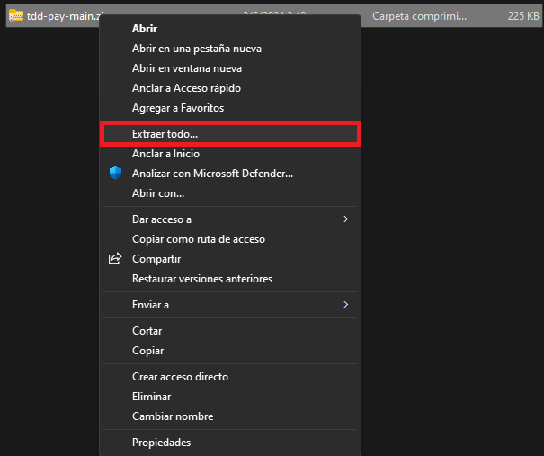
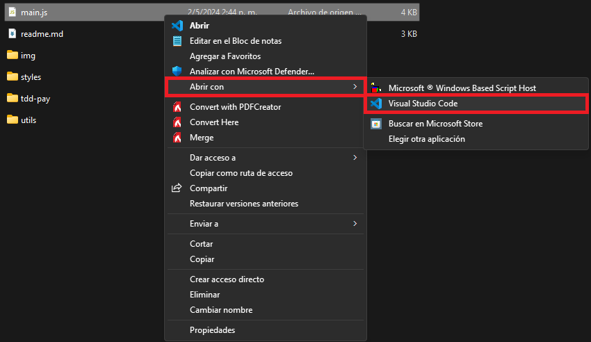
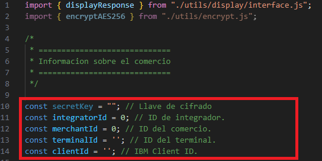
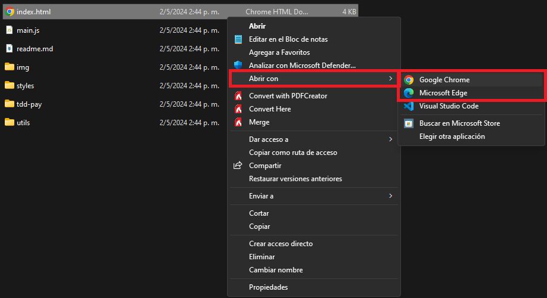
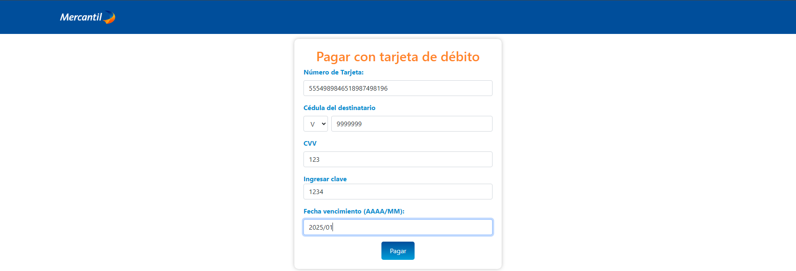
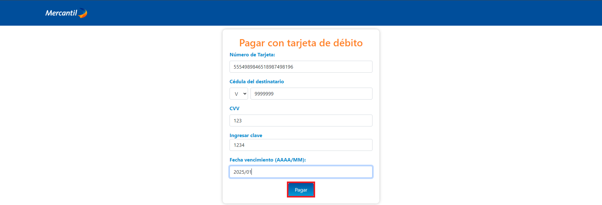

# Botón de Pagos con Tarjeta de Débito

[Más informacion sobre el API](https://apiportal.mercantilbanco.com/mercantil-banco/produccion/product/21031)

### Índice
    
1. [Ejemplo de encriptación](./utils/encrypt.js)
2. [Ejemplo de petición fetch](./tdd-pay/tddPay.js)
3. [API Playground](#playground) 
3.1 [Configuración y uso del API Playground](#playground-config) 
3.2 [Ejemplos de uso del API Playground](#playground-examples)
4. [Request y Response](#rq)
5. [Códigos de error](#error-codes)

## API Playground

### Configuración y uso del API Playground

1. Descargar el código ubicado en este repositorio en su ordenador [pulsando aquí](https://github.com/apimercantil/api-playground/releases/download/V1/tdd-pay.zip). 

2. Descomprimir el archivo descargado en su ordenador. 

3. Abrir con un editor de texto(VS Code, Notepad, Sublime Text, Atom) el archivo **main.js** ubicado en la carpeta principal del ejemplo. 

4. Configurar sus credenciales en el archivo **main.js** (Utilizar las credenciales suministradas por Mercantil Banco). 

5. Abrir el archivo **index.html** en el navegador. 

6. Utilizar los datos de prueba suministrados vía email por Mercantil Banco para rellenar las casillas del formulario en el API Playground. 

### Ejemplos de uso del API Playground

1. Ingresar la información en el formulario. 

2. Presionar el botón del formulario para enviar la petición. 

3. Esperar la carga de la información. 

4. Revisar el request y el response. 

5. Módifica el código a tu gusto y haz las pruebas que requieras.. 

### Request y Reponse

Para información detallada sobre los campos del request pulsa [aquí](https://www.mercantilbanco.com/mercprod/apiportal/pdfs/mapping_campos_tipo_txns_tdd.pdf).

### Códigos de error

Para información detallada sobre la lista de errores pulsa [aquí](https://www.mercantilbanco.com/mercprod/apiportal/pdfs/Errores_con_TDD.pdf).
